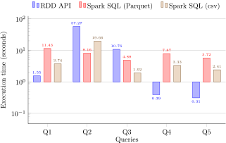

# Big Data Management with PySpark

This repository contains the final project for the Big Data Management course, during the academic year 2022-2023. The project focuses on executing queries on Resilient Distributed Datasets (RDDs) & DataFrame APIs, and handling data in CSV and Parquet formats using PySpark.

## Project Structure

```bash
$PROJECT_ROOT
¦   # Project's outputs (query execution-times, query plans etc.) 
+-- output
¦   # Project's report
+-- report
¦   # Modules for perfoming all tasks 
+-- src
```

## Objective

- Execute queries on RDD and DataFrame APIs.
- Read and write data in CSV and Parquet formats.
- Evaluate Join Algorithms.
- Assess Catalyst's query plans.

## Technologies

- **HDFS**: Utilised as the primary data storage system.
- **PySpark**: Main framework for big data processing.
- **RDDs**: Used to demonstrate distributed data processing.
- **Hive**: Used to demonstrate sql-like data processing.
- **Catalyst Optimiser**: Employs rule-based transformations to optimise query plans.

## Dataset Overview

### movies.csv

| movie_id | name             | description                    | release_year | duration | production_cost | revenue   | popularity |
|----------|------------------|--------------------------------|--------------|----------|-----------------|-----------|------------|
| 1        | The Great Gatsby | A tale of wealth and decadence | 2013         | 143      | 105000000       | 353600000 | 7.3        |

### ratings.csv

| user_id | movie_id | rating | timestamp           |
|---------|----------|--------|---------------------|
| 1       | 1        | 4.5    | 2023-06-29 10:15:00 |

### movie_genres.csv

| movie_id | genre |
|----------|-------|
| 1        | Drama |

### employeesR.csv

| employee_id | name | department_id |
|-------------|------|---------------|
| 1           | John | 1             |

### departmentsR.csv

| department_id | department_name |
|---------------|-----------------|
| 1             | HR              |

## Features

- **Okeanos Cluster**: The project utilises a cluster provided by the course in Okeanos. This comprises a 2-node cluster with 2 cores and 4GB of RAM each.

- **RDDs and DataFrames**: Practical application of Resilient Distributed Datasets (RDDs) and DataFrames in big data scenarios.

- **Evaluation of Join Algorithms**: A detailed analysis of two join algorithms (i.e. broadcast and repartition join), evaluating their performance across different scenarios.

## Getting Started

1. Clone this repository.
2. Set up the environment, ensuring you have the following versions of PySpark and HDFS:
<pre>
spark==2.4.4
hadoop==2.7.7 
</pre>
3. Add the following lines to the Spark configuration (i.e. spark-defaults.conf), paying particular attention to the `park.driver.memory`, since this was a common cause for Java heap errors.:
```bash
spark.master spark://master:7077
spark.submit.deployMode client
spark.executor.instances 2
spark.executor.cores 1
spark.executor.memory 512m
spark.driver.memory 1024m
```
4. Create the following directory:
```bash
hadoop fs -mkdir -p ~/files
```
5. Download the dataset [here](https://www.dropbox.com/s/c10t67glk60wpha/datasets2023.tar.gz?dl=0), and place all the .csv files in the distributed directory:
```bash
hadoop fs -put *.csv ~/files
```
6. Execute the [main.py](./src/main.py) script to perform big data operations.
```bash
spark-submit main.py
```
For more information about execution results, as well as their interpretation, please read the [report](./report/coursework.pdf).

## Sample Outputs

Query [execution-plan](./output/optimised_plan.txt) when joining two realtions, `departmentsR.csv` and `employeesR.csv`, on the attribute `department_id`.
```bash
== Physical Plan ==
*(3) BroadcastHashJoin [mv_id#627], [mv_id#620], Inner, BuildLeft
:- BroadcastExchange HashedRelationBroadcastMode(List(cast(input[0, int, false] as bigint)))
:  +- *(2) Filter isnotnull(mv_id#627)
:     +- *(2) GlobalLimit 100
:        +- Exchange SinglePartition
:           +- *(1) LocalLimit 100
:              +- *(1) FileScan parquet [mv_id#627,genre#628] Batched: true, Format: Parquet, Location: InMemoryFileIndex[hdfs://master:9000/home/user/files/movie_genres.parquet], PartitionFilters: [], PushedFilters: [], ReadSchema: struct<mv_id:int,genre:string>
+- *(3) Project [usr_id#619, mv_id#620, rating#621, time_stamp#622]
   +- *(3) Filter isnotnull(mv_id#620)
      +- *(3) FileScan parquet [usr_id#619,mv_id#620,rating#621,time_stamp#622] Batched: true, Format: Parquet, Location: InMemoryFileIndex[hdfs://master:9000/home/user/files/ratings.parquet], PartitionFilters: [], PushedFilters: [IsNotNull(mv_id)], ReadSchema: struct<usr_id:int,mv_id:int,rating:float,time_stamp:int>
```

Query execution-times, for all queries, using RDDs, CSVs and Parquet.
<p align="center">
  
</p>
